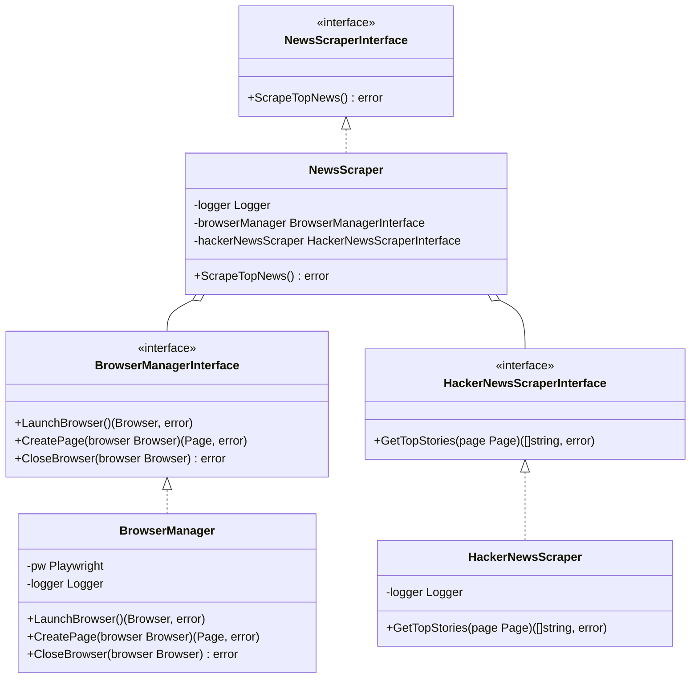
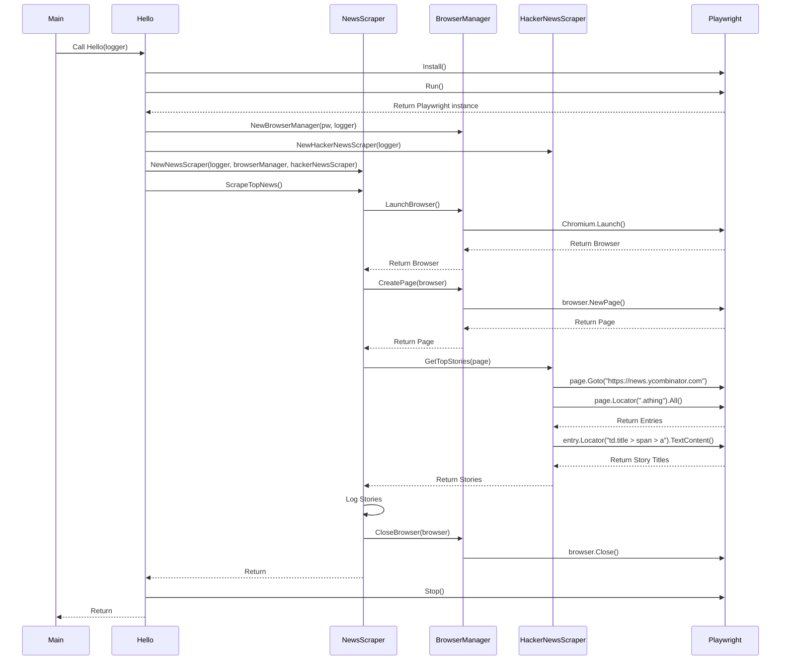

# Class Diagram

```mermaid
classDiagram
    class NewsScraperInterface {
        <<interface>>
        +ScrapeTopNews() error
    }
    class HackerNewsScraperInterface {
        <<interface>>
        +GetTopStories(page Page) ([]string, error)
    }
    class BrowserManagerInterface {
        <<interface>>
        +LaunchBrowser() (Browser, error)
        +CreatePage(browser Browser) (Page, error)
        +CloseBrowser(browser Browser) error
    }
    class NewsScraper {
        -logger Logger
        -browserManager BrowserManagerInterface
        -hackerNewsScraper HackerNewsScraperInterface
        +ScrapeTopNews() error
    }
    class HackerNewsScraper {
        -logger Logger
        +GetTopStories(page Page) ([]string, error)
    }
    class BrowserManager {
        -pw Playwright
        -logger Logger
        +LaunchBrowser() (Browser, error)
        +CreatePage(browser Browser) (Page, error)
        +CloseBrowser(browser Browser) error
    }

    NewsScraperInterface <|.. NewsScraper
    HackerNewsScraperInterface <|.. HackerNewsScraper
    BrowserManagerInterface <|.. BrowserManager
    NewsScraper o-- BrowserManagerInterface
    NewsScraper o-- HackerNewsScraperInterface


```

```mermaid

sequenceDiagram
    participant Main
    participant Hello
    participant NewsScraper
    participant BrowserManager
    participant HackerNewsScraper
    participant Playwright

    Main->>Hello: Call Hello(logger)
    Hello->>Playwright: Install()
    Hello->>Playwright: Run()
    Playwright-->>Hello: Return Playwright instance
    Hello->>BrowserManager: NewBrowserManager(pw, logger)
    Hello->>HackerNewsScraper: NewHackerNewsScraper(logger)
    Hello->>NewsScraper: NewNewsScraper(logger, browserManager, hackerNewsScraper)
    Hello->>NewsScraper: ScrapeTopNews()
    NewsScraper->>BrowserManager: LaunchBrowser()
    BrowserManager->>Playwright: Chromium.Launch()
    Playwright-->>BrowserManager: Return Browser
    BrowserManager-->>NewsScraper: Return Browser
    NewsScraper->>BrowserManager: CreatePage(browser)
    BrowserManager->>Playwright: browser.NewPage()
    Playwright-->>BrowserManager: Return Page
    BrowserManager-->>NewsScraper: Return Page
    NewsScraper->>HackerNewsScraper: GetTopStories(page)
    HackerNewsScraper->>Playwright: page.Goto("https://news.ycombinator.com")
    HackerNewsScraper->>Playwright: page.Locator(".athing").All()
    Playwright-->>HackerNewsScraper: Return Entries
    HackerNewsScraper->>Playwright: entry.Locator("td.title > span > a").TextContent()
    Playwright-->>HackerNewsScraper: Return Story Titles
    HackerNewsScraper-->>NewsScraper: Return Stories
    NewsScraper->>NewsScraper: Log Stories
    NewsScraper->>BrowserManager: CloseBrowser(browser)
    BrowserManager->>Playwright: browser.Close()
    NewsScraper-->>Hello: Return
    Hello->>Playwright: Stop()
    Hello-->>Main: Return
```